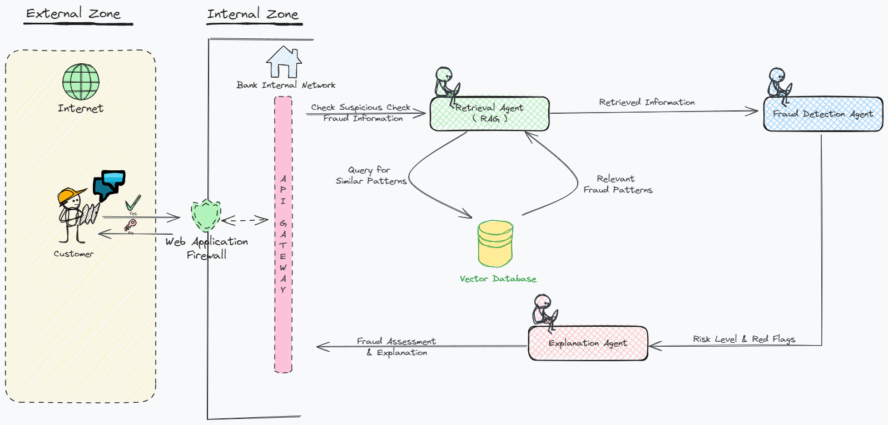

# AI-Powered Check Fraud Multi-Agent Risk Analytics System

## Table of Contents

- [The Challenge of Check Fraud](#the-challenge-of-check-fraud)
- [Our AI-Driven Solution](#our-ai-driven-solution)
- [Project Overview](#project-overview)
- [System Architecture](#system-architecture)
- [Getting Started](#getting-started)
    - [Prerequisites](#prerequisites)
    - [Installation](#installation)
    - [Configuration](#configuration)
- [Running the Application](#running-the-application)
- [Code Components](#code-components)
    - [`app.py`](#apppy)
    - [`modules.py`](#modulespy)
        - [`RetrievalAgent`](#retrievalagent)
        - [`FraudDetectionAgent`](#frauddetectionagent)
        - [`ExplanationAgent`](#explanationagent)
    - [`config.py`](#configpy)
    - [`env.py`](#envpy)
    - [`check_fraud_patterns.csv`](#check_fraud_patternscsv)
- [Agent Interaction Flow](#agent-interaction-flow)
- [Deployment](#deployment)
- [Troubleshooting](#troubleshooting)
- [Challenges and Lessons Learned](#challenges-and-lessons-learned)
- [Contributing](#contributing) 
- [Generative AI Agents Developer Contest -Submission Details](#generative-ai-agents-developer-contest-submission-details)

## The Challenge of Check Fraud

Check fraud remains a persistent threat, costing individuals and businesses billions of dollars annually.  From forged signatures to counterfeit checks, criminals employ various tactics to deceive unsuspecting victims. This type of fraud not only leads to financial losses but also disrupts operations and erodes trust in traditional payment methods.

**Examples:**

* **Forged Signatures:** A fraudster might intercept a legitimate check and forge the payee's signature to cash it illegally.
* **Counterfeit Checks:** Sophisticated printing techniques are used to create realistic-looking checks that are then used to make fraudulent purchases or withdrawals. 

## Our AI-Driven Solution

This project leverages the power of artificial intelligence (AI) and a multi-agent system to combat check fraud effectively. By combining NVIDIA's powerful large language models (LLMs) with Langchain's streamlined development framework and LangGraph's agent orchestration capabilities, we've created a system that can analyze check-related information, identify potential fraud, and explain its reasoning in a user-friendly way.

* **Reason for Choosing "meta/llama3-8b-instruct":** 

    "We've chosen to use the "meta/llama3-8b-instruct" model from NVIDIA's LLM offerings for several reasons:

    * **Strong Instruct Capabilities:** This model is specifically fine-tuned for instruction following, making it well-suited for our use case where we need the LLM to understand and respond accurately to prompts designed for information retrieval, fraud detection, and explanation generation. 
    * **Balance of Size and Performance:**  The 8 billion parameter size provides a good balance between computational efficiency and model capability. It allows us to achieve good performance on our tasks without requiring excessive computational resources. 
    * **Availability through NVIDIA's API:** The model's availability through NVIDIA's convenient API endpoint simplifies our development and deployment processes, making it easy to integrate into our application.

    While other LLM options exist, the "meta/llama3-8b-instruct" model's strengths in instruction following, its balance of size and performance, and its seamless integration with NVIDIA's API make it an excellent choice for our check fraud detection system." 

* **Semantic Understanding with NVIDIAEmbeddings:**

  * To accurately match user input with relevant fraud patterns, our system relies on a powerful technique called embeddings. Embeddings are mathematical representations of text that capture the semantic meaning of words and phrases. We utilize `NVIDIAEmbeddings(model="NV-Embed-QA")`, a model specifically designed for question answering, to generate these embeddings.
  * So by leveraging the semantic understanding of `NVIDIAEmbeddings(model="NV-Embed-QA")`, our Retrieval Agent can connect the dots between user queries and relevant fraud patterns, even when the wording isn't an exact match. This results in more accurate and relevant information retrieval, which is crucial for effective fraud detection.

**Here's how these technologies work together:**

1. **NVIDIA API Endpoints for LLMs:** We use NVIDIA's LLMs, accessed through their API endpoints, to power the intelligence behind our agents. These LLMs give our system the ability to understand and generate natural language, which is crucial for analyzing check information and providing clear explanations.

2. **Langchain for Streamlined AI Development:** Langchain makes it much easier to build and manage our AI pipeline. It provides a standardized way to interact with LLMs, handle prompts, and chain together different AI components, making development more efficient.

3. **LangGraph for Multi-Agent Orchestration:** LangGraph acts as the conductor of our multi-agent system. It defines how our specialized agents (Retrieval, Fraud Detection, and Explanation) interact with each other, ensuring they work together seamlessly to process information and arrive at a well-informed decision.

**Example: `app.py` (Illustrating the Technology Integration)**

```python
# Import necessary libraries 
from langchain_nvidia_ai_endpoints import ChatNVIDIA  # Access NVIDIA's LLMs
from langgraph.graph import StateGraph, END           # For LangGraph workflows

# Initialize NVIDIA LLM using Langchain
llm = ChatNVIDIA(
    model="meta/llama3-8b-instruct",                 # Specify the LLM model
    nvidia_api_key=os.environ["NVIDIA_API_KEY"],     # Load your API key
)

# ... (Initialization of agents using Langchain components) ... 

# Define LangGraph workflow for agent collaboration
graph = StateGraph(AgentState)
graph.add_node("orchestrator", retrieval_agent.retrieve_relevant_info)
graph.add_node("fraud_detection", fraud_detection_agent.assess_fraud_risk)
graph.add_node("explanation", explanation_agent.generate_explanation) 
# ... (Define edges to control agent interaction flow) ... 

app = graph.compile()  # Create the LangGraph application
```

In this example:

- `ChatNVIDIA` from `langchain_nvidia_ai_endpoints` allows us to easily use NVIDIA's powerful LLMs. 
-  The agents are constructed using various Langchain tools and components.
- `StateGraph` from `langgraph` defines the steps our agents take to analyze check information.

This collaborative approach enables us to analyze checks for potential fraud effectively and provide users with transparent, understandable explanations for the system's assessments.

## Project Overview

This repository contains the Python code for our AI-powered check fraud detection system. It showcases how to build a robust system using:

- **Langchain:** For simplified interaction with LLMs and creating efficient AI workflows.
- **LangGraph:** For coordinating the actions and information flow between multiple specialized agents.
- **Vector Databases:** For storing and querying information about check fraud patterns. 
- **NVIDIA's LLMs:** For advanced natural language processing capabilities, accessed through their intuitive API.

This project aims to demonstrate a practical, AI-driven solution to a real-world problem. 

## System Architecture

**A detailed diagram illustrating the interaction between components:**


* **User Input:** How the user provides information about the check.
* **Retrieval Agent:** How it receives user input, interacts with the vector database, and retrieves relevant fraud patterns.
* **Fraud Detection Agent:** How it assesses risk based on retrieved information and potentially other factors.
* **Explanation Agent:** How it generates a user-friendly explanation of the assessment.
* **Output:** How the final assessment and explanation are presented to the user.)**

| Feature                       | Detail                                         |
|--------------------------------|-------------------------------------------------|
| Project Category               | Generative AI Agents                           |
| Large Language Model (LLM)     | meta/llama3-8b-instruct                       |
| LLM Parameter Size            | 8 Billion Parameters                          |
| Tested Hardware               | Tesla T4 GPU                                 | 
| Framework                     | LangChain                                      | 
| Agent Orchestration Framework | LangGraph                                     | 
| Vector Database              | FAISS                                         | 
| Primary Use Case             | Check Fraud Detection & Risk Analytics          |
| Deployment Strategy          | Containerization (Docker), Cloud Deployment, API |

## Getting Started

### Prerequisites

- **Python 3.8+:** Ensure you have a compatible Python version. You can download the latest version from [https://www.python.org/](https://www.python.org/).
- **Conda (Recommended):** Install the Conda package manager from [https://docs.conda.io/en/latest/miniconda.html](https://docs.conda.io/en/latest/miniconda.html) 
- **NVIDIA API Key:**  Obtain your API key from the NVIDIA Developer website: [https://developer.nvidia.com/](https://developer.nvidia.com/). 

### Installation

1. **Create a Conda Environment:**
   ```bash
   conda create -n check-fraud-env python=3.8  # Replace '3.8' with your desired Python version
   conda activate check-fraud-env
   ```
2. **Clone the repository:**
   ```bash
   git clone https://github.com/dprasadk/nvidia-dev-cont-dp.git  # Replace with your actual repository URL
      ```
3. **Navigate to the project directory:**
   ```bash
   cd nvidia-dev-cont-dp  # Replace 'nvidia-dev-cont-dp' with your actual directory name
   ```
4. **Install dependencies (make sure your virtual environment is activated):**
   ```bash
   pip install -r requirements.txt 
   ```
   This will install all the necessary libraries listed in the `requirements.txt` file.

   ```bash
    sudo apt-get install graphviz libgraphviz-dev pkg-config
    pip install pygraphviz
   ```
   To generate Multi-Agent Visuals , we needs to install these libraries separetely.

### Configuration

1. **Create a `.env` file in the root directory of your project.**
2. **Add your NVIDIA API key to the `.env` file:**
   ```
   NVIDIA_API_KEY=your_actual_api_key
   ```
   Replace `your_actual_api_key` with your NVIDIA API key.

## Running the Application

1. **Make sure your Conda environment is activated.**
2. **Start the Chainlit application:**
   ```bash
   chainlit run app.py --port 8500 
   ```
   - This will start the Chainlit development server.
   - We can use any ```--port <number of our choice , use 8000 and above>.```
   
3. **Open the chatbot interface:**
   - Open your web browser and navigate to `http://localhost:8500` (or the specific port you specified) to interact with your AI-powered check fraud detection chatbot.

## Code Components

### `app.py`

The main application file that orchestrates the entire check fraud detection process.

**Key Responsibilities:**

- **API Initialization:** Initializes connections to external APIs like NVIDIA's LLM endpoint.
- **Agent Instantiation:** Creates instances of all the agents: `RetrievalAgent`, `FraudDetectionAgent`, and `ExplanationAgent`.
- **LangGraph Workflow Definition:** Defines the sequence of actions and information flow between agents using `langgraph`. 
- **User Interaction Handling:** Manages how the application receives user input (e.g., information about the check) and presents the final output (risk assessment and explanation).

**Code Snippet (Simplified Example):**

```python
# ... import statements ...

# Initialize LLM and Agents
llm = ChatNVIDIA(model="meta/llama3-8b-instruct", nvidia_api_key=os.environ["NVIDIA_API_KEY"])
retrieval_agent = RetrievalAgent(llm=llm, ...) # ... pass necessary dependencies
fraud_detection_agent = FraudDetectionAgent(llm=llm, ...)
explanation_agent = ExplanationAgent(llm=llm, ...)

# Define LangGraph Workflow
graph = StateGraph(AgentState)
graph.add_node("start", retrieval_agent.retrieve_relevant_info) 
graph.add_node("fraud_check", fraud_detection_agent.assess_fraud_risk) 
graph.add_node("explain", explanation_agent.generate_explanation) 
graph.add_edge("start", "fraud_check")  # Define agent execution order
graph.add_edge("fraud_check", "explain") 
app = graph.compile()

# ... (Code to handle user interaction, input, and output) ...
```

### `modules.py`

This file contains the implementation of our intelligent agents.

#### `RetrievalAgent`

**Purpose:**
- Takes user input (check information) and queries a vector database to find relevant information about check fraud patterns.

**Key Functionality:**

- **Vector Database Interaction:** Employs a vector database (e.g., FAISS) to efficiently search for similar fraud patterns based on the user's input.
- **Semantic Similarity:** Uses embeddings from the LLM to represent both user input and fraud patterns as vectors, allowing for similarity comparisons.
- **Relevant Information Retrieval:**  Retrieves the most relevant fraud patterns from the database. 

**Code Snippet Example:**

```python
from langchain_nvidia_ai_endpoints import NVIDIAEmbeddings # Import the correct embeddings
from langchain.vectorstores import FAISS 

class RetrievalAgent:
    def __init__(self, llm, vectorstore): 
        self.llm = llm
        self.vectorstore = vectorstore
        self.embeddings = NVIDIAEmbeddings(model="NV-Embed-QA") # Use NVIDIAEmbeddings

    async def retrieve_relevant_info(self, input_data: AgentState) -> AgentState:
        user_input = input_data.get("input")
        # ... (Error handling if user input is missing) ...

        # Create embeddings for user input
        input_embedding = self.embeddings.embed_query(user_input)

        # Query the vector database 
        docs = self.vectorstore.similarity_search_by_vector(input_embedding, k=3) 
        #  'k=3' retrieves the top 3 most similar documents

        # ... (Process and format the retrieved documents) ... 

        # Update AgentState with retrieved information
        input_data["retrieved_info"] =  # ... (Add the processed documents) ...
        return input_data
```

#### `FraudDetectionAgent`

**Purpose:**
- Assesses the risk of fraud (High, Medium, Low) based on the information retrieved by the `RetrievalAgent` and potentially other factors.

**Key Functionality:**

- **Risk Assessment Logic:** Implements rules or a machine learning model to determine the likelihood of fraud. 
- **Red Flag Identification:**  Identifies specific elements in the retrieved information or user input that contribute to the risk assessment (e.g., "Unknown sender," "Large transaction amount").

**Code Snippet Example (Simplified Rule-Based Example):**

```python
class FraudDetectionAgent: 
    # ... 

    async def assess_fraud_risk(self, input_data: AgentState) -> AgentState:
        retrieved_info = input_data.get("retrieved_info") 
        # ... (Error handling if retrieved information is missing) ...

        risk_level = "Low"  # Default risk level
        red_flags = []

        # Rule-based risk assessment
        for doc in retrieved_info:
            # ... (Logic to extract relevant information from documents) ...
            if  # ... (Condition based on retrieved info - e.g., large amount, unknown sender) ... :
                risk_level = "Medium" 
                red_flags.append("Large transaction amount from an unfamiliar source.")
            # ... (More rules to adjust risk level and identify red flags) ... 

        # Update AgentState with risk assessment 
        input_data["risk_level"] = risk_level
        input_data["red_flags"] = red_flags 
        return input_data
```

#### `ExplanationAgent`

**Purpose:**
- Generates a clear, concise, and user-friendly explanation of the fraud risk assessment.

**Key Functionality:**

- **Natural Language Generation:**  Uses the LLM to craft a human-readable explanation. 
- **Red Flag Highlighting:** Clearly presents the identified red flags to the user. 
- **Fraud Prevention Tips:**  May provide actionable advice to the user based on the assessment. 

**Code Snippet Example:** 

```python
class ExplanationAgent:
    def __init__(self, llm):
        self.llm = llm

    async def generate_explanation(self, input_data: AgentState) -> AgentState:
        risk_level = input_data.get("risk_level", "Low") # Default to "Low"
        red_flags = input_data.get("red_flags", [])

        # ...(Construct the prompt for the LLM) ... 
        prompt_template = """
        The check fraud detection system has assessed the following risk level: {risk_level}
        Red flags identified: {red_flags}
        Explain the risk level to the user in a clear and concise manner, highlighting the red flags.  
        Offer advice on what precautions the user could take.
        """
        prompt = PromptTemplate(
            input_variables=["risk_level", "red_flags"], 
            template=prompt_template 
        )
        
        # ... (Use the LLM to generate the explanation from the prompt) ... 

        # Update AgentState with the explanation 
        input_data["explanation"] =  # ... (Add the generated explanation) ... 
        return input_data
```

### `config.py`

This file centralizes configuration settings and file paths used throughout the application.

**Purpose:**
- Provides a single source of truth for configuration data.
- Makes it easy to modify settings without changing the core code. 

**Example:**

```python
import os

BASE_DIR = os.path.dirname(os.path.abspath(__file__))

# Data Directory
DATA_DIR = os.path.join(BASE_DIR, 'data')

# Vector Database Path
VECTOR_DB_PATH = os.path.join(DATA_DIR, "my_check_fraud_db") # Path to your vector database

# ... Other configuration settings ...
```

### `env.py`

This script helps you create a `.env` file to store sensitive information like API keys.

**Purpose:**
- Improves security by keeping sensitive data out of your codebase.
- Simplifies the process of setting up environment variables.

**Example Usage:**

```bash
python env.py
```

This script will usually prompt you to enter the required information (e.g., your NVIDIA API key) and then create or update the `.env` file accordingly.

### `check_fraud_patterns.csv`

This CSV file contains the dataset used to populate your vector database.

**Data Format:**

```
pattern_name,description,red_flags,risk_level
Unknown Sender with Large Amount,"Be wary of checks from unfamiliar individuals or businesses, especially for significant sums.","Sender is not known to the recipient,Check amount is unusually high",medium
Overpayment Scam,"Scammers send a check for more than the agreed amount, asking for the difference to be returned.","Check is for more than the expected amount,Sender requests a refund or payment",high
# ... more patterns
```

**Data Preprocessing:**

Before adding this data to the vector database, you'll likely need to perform some preprocessing:

1. **Clean the data:** Handle missing values, remove duplicates, and ensure data consistency.
2. **Extract relevant features:** Identify the key features from each pattern that will be used for similarity comparisons.
3. **Generate embeddings:** Use an embedding model (like those available through Langchain) to represent each fraud pattern as a vector.

## Agent Interaction Flow

**Multi-Agent Workflow Visualization:**
- This diagram  visualizes the LangGraph workflow of our check fraud agents.
  


1. **User Input:** The user provides information about the check, such as the sender, amount, and any unusual circumstances.

2. **Retrieval Agent:**
   - Receives the user input.
   - Generates an embedding of the user input using the LLM.
   - Queries the vector database for the most similar check fraud patterns based on the embedding.
   - Passes the retrieved information to the `FraudDetectionAgent`.

3. **Fraud Detection Agent:**
   - Analyzes the retrieved patterns and compares them to the user's input.
   - Uses predefined rules or a machine learning model to assess the risk of fraud.
   - Identifies specific red flags based on the assessment.
   - Passes the risk level and red flags to the `ExplanationAgent`.

4. **Explanation Agent:**
   - Receives the risk level and red flags.
   - Constructs a prompt for the LLM, including the risk assessment and identified red flags.
   - The LLM generates a user-friendly explanation, highlighting the reasons for the assessment and potential precautions the user can take.

5. **Output:**  The system presents the risk assessment, identified red flags, and the LLM-generated explanation to the user. 

## Deployment

This section outlines potential deployment strategies for this check fraud detection system. While specific deployment instructions are beyond the scope  of this contest submission, the following methods highlight possible real-world implementation approaches, emphasizing the benefits of  using NVIDIA's API and Chainlit:

- **Simplified Deployment with NVIDIA and Chainlit:** 

    - By utilizing NVIDIA's powerful LLMs through their API, we eliminate the need to manage complex LLM infrastructure ourselves. This API-driven approach simplifies deployment and makes the system easily scalable. 
    - Chainlit further streamlines development and deployment by providing tools for building user interfaces and interactive experiences around our LLM application. This can be particularly useful for showcasing the system's capabilities during the contest.

- **Flexible Deployment Options:**
    - **Containerization (Docker):**  The application can be packaged into a Docker container for consistent deployment across environments and cloud platforms.
    - **Cloud Deployment:**  Cloud platforms like AWS, Google Cloud, or Azure provide various services for deploying the system, using serverless functions, container orchestration, or virtual machines. 
    - **API Integration:** Exposing the check fraud detection logic as an API allows for easy integration into other applications or systems. 

The choice of the most appropriate deployment method will depend on specific requirements and constraints, but the project's design using NVIDIA's API and Chainlit ensures flexibility and scalability. 


## Troubleshooting

This section outlines some common problems you might encounter while setting up or running the check fraud detection system. If your issue isn't listed here, feel free to open an issue on our [issue tracker](#https://github.com/dprasadk/nvidia-dev-cont-dp/issues).


### API Key Errors

**Problem:** You might encounter errors like "Invalid API key" if your NVIDIA API key is not set correctly.

**Solution:**
1. **Check your `.env` file:** Ensure that the `NVIDIA_API_KEY` variable is present in your `.env` file and contains the correct API key.
2. **Verify environment variable loading:** Make sure your application is loading environment variables from the `.env` file correctly. You can use a library like `python-dotenv` for this purpose.
3. **Double-check your API key:** If the problem persists, visit the [NVIDIA Developer website](https://developer.nvidia.com/) to confirm that your API key is still valid and hasn't been revoked or expired.

### Dependency Issues

**Problem:** Conflicting dependencies or missing packages can prevent the application from running as expected.

**Solution:** 
1. **Create a fresh environment:** If you're facing dependency conflicts, it's often best to create a new virtual environment or Conda environment and reinstall the dependencies:
   ```bash
   # Using venv 
   python3 -m venv .venv 
   source .venv/bin/activate
   pip install -r requirements.txt 

   # Using Conda
   conda create -n check-fraud-env python=3.8 
   conda activate check-fraud-env
   pip install -r requirements.txt
   ```
2. **Install specific versions:**  If you suspect a package is causing issues, you can try installing a specific version:
   ```bash
   pip install package-name==version-number  # Example: pip install langchain==0.0.154
   ```
3. **Check for typos:**  Double-check that package names in your `requirements.txt` file are spelled correctly. 

### Vector Database (FAISS) Loading Issues

**Problem:** The application fails to load or find the FAISS index.

**Solutions:** 

- **Verify File Path:** Double-check that the path to your FAISS index file (`VECTOR_DB_PATH` in `config.py`) is correct and that the file exists. Remember that file paths are relative to where you run your Python script.
- **Index Creation:** If the index file is missing, you might need to create it first.  Refer to the FAISS documentation or the code section where you build the index for instructions on how to generate the index from your dataset.
- **FAISS Version Compatibility:** Ensure that the version of FAISS installed in your environment is compatible with the code. You can check the FAISS version using `pip show faiss` or by referring to the `requirements.txt` file. If there's a mismatch, you might need to install a specific FAISS version. 
- **Data Dimensionality:** If you've recently updated FAISS or your embedding model, ensure that the dimensionality of your stored embeddings matches the expected dimensionality of the FAISS index. Mismatched dimensions can cause loading errors.

### Performance Issues

**Problem:**  The application might be slow to respond, especially when handling large amounts of data or complex queries.

**Solution:**
1. **Optimize database queries:**  Use indexing in your vector database to speed up similarity searches. Consider using more efficient query methods if available.
2. **Code optimization:**  Profile your code to identify performance bottlenecks and optimize them. Use efficient data structures and algorithms.
3. **Hardware upgrade:** If your application is computationally intensive, consider upgrading to a machine with more RAM, CPU cores, or a dedicated GPU.
4. **Caching:** Implement caching mechanisms to store the results of frequently used queries or computations, reducing redundant processing. 

## Challenges and Lessons Learned

Building this AI-powered check fraud detection system was a rewarding journey filled with valuable lessons. Here are some key challenges we encountered and the insights we gained along the way:

**1.  The Mysterious "[400] Bad Request" and the Importance of Isolation:**

   - **Challenge:**  We faced a persistent "[400] Bad Request" error during the retrieval step, initially pointing to an issue with the NVIDIA API. However, the error message itself wasn't very specific, and we had multiple components involved (FAISS, LangChain's `RetrievalQA`, the embedding model).
   - **Lesson:**  When debugging complex systems, **isolation is key**.  We systematically tested each component in isolation (direct embedding model test, separate FAISS retrieval script, minimal `retriever_QA` example) to pinpoint the source of the error.

**2.  Assumptions About Return Values and the Need for Careful Inspection:**

   - **Challenge:** We ran into errors ("too many values to unpack" and "object of type 'Document' has no len()") because we assumed a specific structure for the data returned by `faiss_index.similarity_search()`.  
   - **Lesson:**  **Never assume the structure of data returned from libraries or APIs.**  Always inspect the data type, length, and content (using `print` statements or a debugger) to understand its format.  Adapting code to unexpected data structures is often necessary.

**3.  Code Restructuring and the Importance of Thorough Testing:**

   - **Challenge:**  As we restructured the code (moving `perform_rag` and adjusting how the `retriever` object was passed), we introduced minor but critical errors (incorrect use of `self`, missing arguments).
   - **Lesson:**  **Anytime you refactor or restructure code, even seemingly small changes, thorough testing is essential.**  Test each change in isolation to quickly catch and fix errors.

**4. Persistence is Key, But Don't Be Afraid to Seek Help:**

   - **Challenge:** Debugging this issue took time and multiple iterations. It's easy to get discouraged when errors persist.
   - **Lesson:** Persistence is crucial for debugging, but **don't hesitate to ask for help** from the community, documentation, or support channels. Sometimes, a fresh perspective or additional knowledge can make a world of difference.

## Contributing

We welcome contributions!  Here’s how you can get involved:

- **Reporting Issues:** Found a bug? Have a suggestion? Head over to our issue tracker and let us know: [link to issue tracker](#https://github.com/dprasadk/nvidia-dev-cont-dp/issues).


## Generative AI Agents Developer Contest-Submission Details

- This project was developed for NVIDIA's Gen AI Agents Developer Contest.
    > *Check out our NVIDIA/Langchain contest submission on 𝕏! : [Click me @URL..!](#https://x.com/barelylibel/status/1802725523954479572)* 


